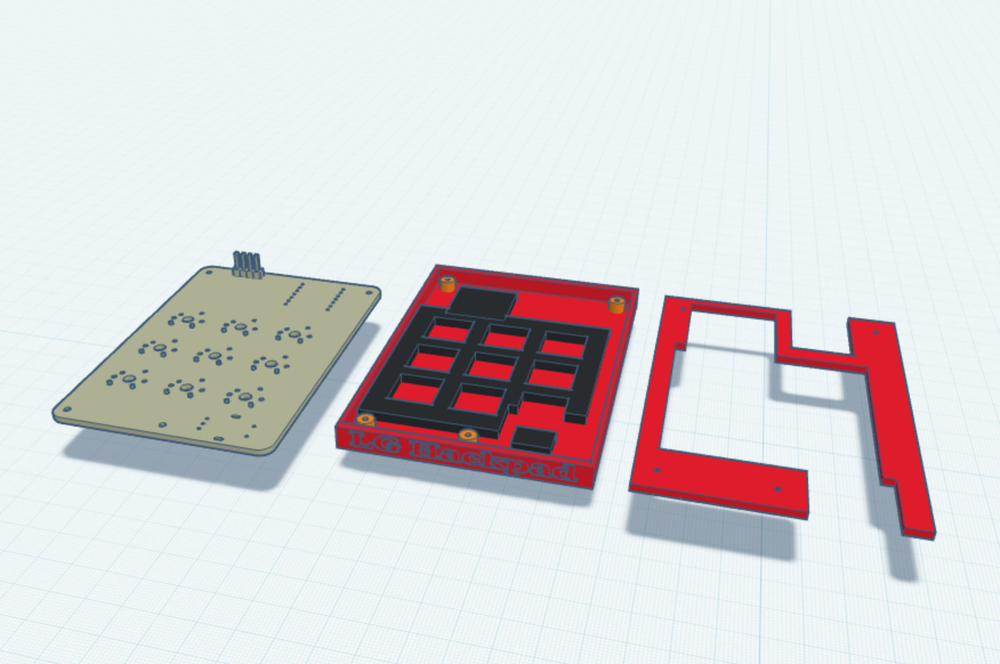
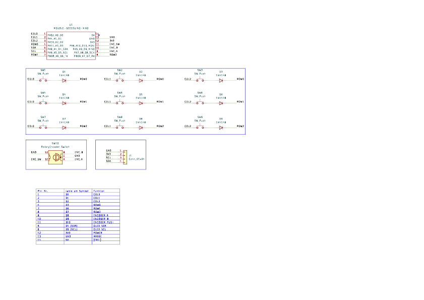
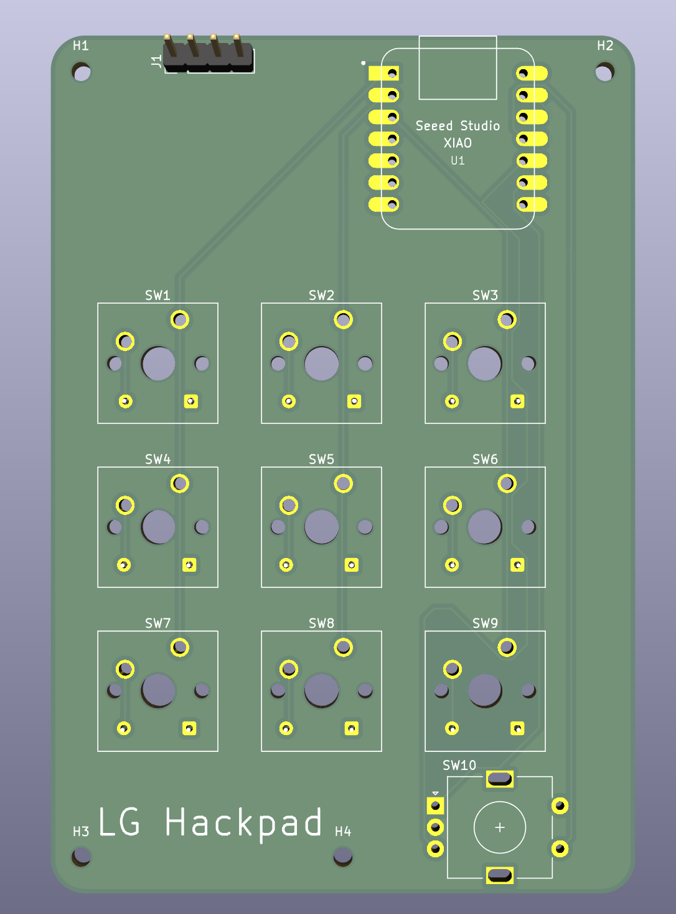
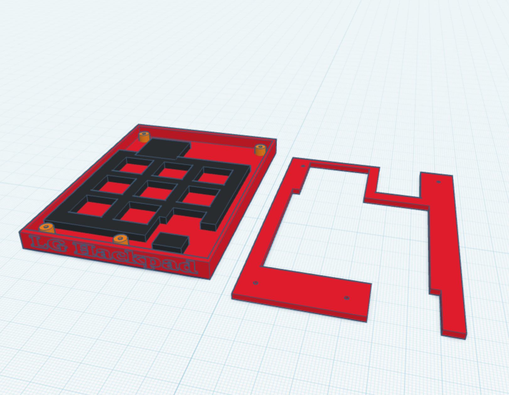

# Hackpad

A custom 9-key mechanical macropad with a rotary encoder and OLED display, built around the **Seeed XIAO RP2040**. Designed from scratch in KiCad as part of [Hack Club's Hackpad YSWS](https://hackpad.hackclub.com/).



## Inspiration & challenges

I wanted a macropad that isn't just static keys but actually adapts to what I'm
doing — so the **rotary encoder browses through profiles** (turn to preview on
the OLED, click to confirm) and **every one of the 9 keys is freely
configurable** through a desktop app, either as a key combo or a custom script.

Biggest challenges as a first-timer:
- **Routing a 2-layer board by hand** around the matrix diodes and the encoder
  without crossing nets, while keeping a clean GND pour.
- **Fitting everything under 100 × 100 mm** — I had to shrink the outline and
  move the bottom edge and mounting holes without breaking the carefully placed
  switch matrix (final size: **68 × 99.68 mm**).
- **An open case without print supports** — exposed XIAO RP2040 because it looks
  cool, plus an anti-flex support grid under the PCB so the board doesn't bend
  when pressing keys.

## Features

- **3×3 mechanical switch matrix** (9× Cherry MX–compatible keys) with per-key 1N4148 diodes for full n-key rollover
- **Rotary encoder** (EC11) with push button — for volume, scrolling, etc.
- **0.96" OLED display** (SSD1306, I²C) for layer/status info
- **Seeed XIAO RP2040** microcontroller (through-hole)
- Custom PCB + 3D-printed case

## Bill of materials (BOM)

| # | Qty | Part | Notes |
|---|-----|------|-------|
| 1 | 1 | Seeed XIAO RP2040 | main MCU (through-hole) |
| 2 | 9 | Cherry MX–compatible switch | PCB-mount, 3×3 matrix |
| 3 | 9 | 1N4148 diode | THT, per-key (COL→ROW), n-key rollover |
| 4 | 1 | EC11 rotary encoder w/ push switch | profile browser |
| 5 | 1 | SSD1306 0.96" OLED (I²C, 4-pin) | status / profile preview |
| 6 | 1 | Custom PCB (2-layer) | 68 × 99.68 mm |
| 7 | 1 | 3D-printed case (tray + open top frame) | PLA, no supports |
| 8 | 4 | M2 screw | case mounting |
| 9 | 9 | Keycap (DSA) + 1 encoder knob | from the kit |

### Pin mapping (XIAO RP2040)

| Function | Pin | | Function | Pin |
|----------|-----|---|----------|-----|
| COL0 | D0 | | ROW0 | D3 |
| COL1 | D1 | | ROW1 | D6 |
| COL2 | D2 | | ROW2 | D7 |
| Encoder A | D8 | | OLED SDA | D4 |
| Encoder B | D9 | | OLED SCL | D5 |
| Encoder SW | D10 | | | |

Matrix is wired **COL2ROW**: column → switch → diode anode, diode cathode → row.

## Gallery

| Schematic | PCB | Case |
|-----------|-----|------|
|  |  |  |

## Project status

- [x] Schematic (ERC clean)
- [x] PCB layout — components placed, all nets routed
- [x] Rounded board outline (68 × 99.68 mm — under the 100 × 100 mm limit)
- [x] Mounting holes (4× M2)
- [x] GND copper pour (both layers)
- [x] DRC clean (apart from intentional diode-under-switch placement)
- [x] STEP 3D model exported (for case design)
- [x] Case — bottom tray (Tinkercad: walls, USB cutout, 4× M2 standoffs, PCB anti-flex support grid)
- [x] Case — top frame (open design, XIAO RP2040 exposed, 9× switch openings, encoder cutout, name/branding)
- [x] Case fitted to resized PCB & exported as STL (no-supports, printer-friendly orientation)
- [x] Firmware — CircuitPython base (matrix, encoder profile-browser, OLED, JSON-config macro engine)
- [ ] Firmware — hardware bring-up & test (pending physical board)
- [x] Configurator app — base GUI (Python + CustomTkinter: device detect, profiles, key editor, save to device)
- [x] Configurator app — full 100% virtual keyboard (QWERTZ, per-OS Win/Mac layout), scrollable profiles, double-click build (PyInstaller)
- [ ] Configurator app — cross-OS packaging (Windows .exe / Linux build)

## Repository layout

```
hackpad.kicad_pro          KiCad project
hackpad.kicad_sch          Schematic
hackpad.kicad_pcb          PCB layout
KiCAD-lib/                 Project-specific footprints
export/hackpad.step        3D model of the PCB (CAD reference for the case)
export/hackpad-gerbers.zip Fabrication gerbers + drill (production, ready for JLCPCB)
case/                      3D-printed case model (Tinkercad → STL: tray + open top frame)
firmware/                  CircuitPython firmware (config-driven macro engine)
app/                       Configurator GUI (Python + CustomTkinter)
docs/                      config.json schema & script-syntax contract
images/                    Renders & photos (used in this README)
```

## Building

PCB is designed for fabrication at JLCPCB (2-layer). Firmware and assembly
instructions will follow once the hardware is finalized.

## Use of AI in this project

I want to be transparent about how AI (Claude) was used here:

- **PCB design** — done entirely by me, by hand, in KiCad. The AI did **not**
  create the schematic or the board layout. It only made suggestions and
  answered questions when I got stuck (e.g. how to shrink the outline under
  100 mm without moving my mounting holes). Every footprint placement, trace
  and the final layout decisions are mine.
- **3D case** — designed entirely by me in Tinkercad. The AI did **not** model
  the case. It only answered questions about the program's rules (size limits,
  the no-supports requirement, tolerances) and reviewed my exported STL against
  those rules. The geometry, the open design and the support structure are mine.
- **Firmware** — here the AI did the heavy lifting: I set the direction and the
  vision (encoder browses profiles, OLED status screen, each of the 9 keys
  freely assignable, JSON-config-driven macro engine), and the AI implemented
  the CircuitPython code to match that.
- **Configurator app** — built collaboratively from my concept (the layout and
  feature set come from my sketch/PDF), with the AI writing much of the
  CustomTkinter code.

In short: **hardware (PCB + case) is my own work**; the AI assisted mainly on
the software side and as a sounding board for questions.

## Acknowledgements

Built as part of the **Hack Club Hackpad** program. Hardware design and layout
done by hand in KiCad — this was my first PCB. 🎉

## License

[MIT](LICENSE) — for both the software (firmware + app) and the hardware
(PCB + case). You're free to use, modify and share it; just keep the credit.
